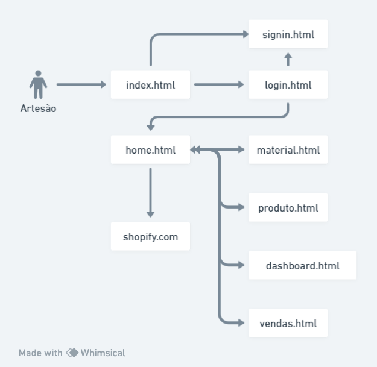

# Projeto Nívea de Laço 

## 1. Objetivo

O objetivo deste documento é definir as necessidade e características da aplicação na visão do administrador do Projeto Nívea de Laço

## 2. Descrição do Sistema

O projeto Nívea de laço consiste em uma aplicação com o objetivo de entregar para um administrado de produtos que podem ser vendidos em storefronts, um ambiente onde possa manter os cadastros e controles de seus produtos bem como visualizar informações que sejam relevantes relacionadas aos seus produtos.

O objetivo é fazer uma integração com a parte headless do shopify (mas pode ser com outros storefronts), para que os cadastros e controles possam ser feitos por nossa aplicação enviando os dados para a api do shopify.

O sistema irá conter as seguintes funcionalidades:

- Cadastros dos materiais, que são todos os insumos para produzir os produtos
    - Ser possível informar os custos de cada material
- Cadastros dos produtos (laços) sendo informado os materiais que serão utilizados
    - Precificação automática dos produtos, baseado no custo de cada material envolvido e aplicada a regra de lucro ou informado de maneira manual
- Integração com o shopify
    - Quando o produto for cadastrado, ser enviado automaticamente para o o shopify
- Integração reversa para informar quantos produtos ainda tem em estoque a medida que as vendas forem realizadas na plataforma de venda
- Sugerir compra de materiais com base no estoque de materiais

## 3. Partes interessadas

### Artesã (o)

|                |                          |
|----------------|-------------------------------|
| Descrição | Pessoa interessada em manter seus dados de maneira eletrônica e de fácil acesso para atualizar de maneira automática no ambiente de storefront. |
| Papel | Manter os cadastros dentro do sistema |
| Insumos ao projeto | Requisitos |
| Representante | Christian Pompeu da Silva |

## 4. PERSONAS

### Usuário

|                |                          |
|----------------|-------------------------------|
| Descrição | Pessoa que utiliza o sistema para manter os cadastros e a integração |
| Papel | Utilizar o sistema |
| Insumos ao projeto | Cadastro dos materiais. Cadastro dos produtos |
| Representante | Christian Pompeu da Silva |

### Shopify

|                |                          |
|----------------|-------------------------------|
| Descrição | Ambiente de Storefront onde os produtos serão enviados por meio da aplicação |
| Papel | funcionar como loja virtual alimentada pela integração |
| Insumos ao projeto | API para cadastro de produtos e demais funcionalidades disponibilizadas |
| Representante | Christian Pompeu da Silva |

## 5. Necessidades e Funcionalidades

- #N001. Cadastrar material
    - #N001-F001. Inserir novo material
    - #N001-F002. Listar materiais
    - #N001-F003. Visualizar e editar material
    - #N001-F004. Excluir materiais cadastrados
- #N002. Cadastrar Produto
    - #N002-F001. Inserir novo produto
    - #N002-F002. Listar produtos
    - #N002-F003. Visualizar e editar produto
    - #N002-F004. Excluir produtos cadastrados
- #N003. Integrar com Shopify
    - #N003-F001. Integrar produtos cadastrados com ambiente do shopify
    - #N002-F002. Atualizar estoque dos produtos com base nas vendas realizadas
    - #N002-F003. Informar necessidade de repor produto e materiais

## 6. Arquitetura
|                |                          |                          |
|----------------|-------------------------------|-------------------------------|
| Linguagem | Typescript | https://www.typescriptlang.org/ |
| Framework FrontEnd | React com Next JS | https://nextjs.org/ |
| Banco de Dados | Vercel Postgres | https://vercel.com/docs/storage/vercel-postgres |
| ORM | Prisma | https://www.prisma.io/ |
| Deploy | Vercel | https://vercel.com/ |
| Framework de Estilização | Gluestack | https://ui.gluestack.io/ |

## 7. Configuração Ambiente

- Visual Studio Code
    - Extensões:
        - Prisma CLI
        - Vercel CLI

## 8. Fluxo de telas

